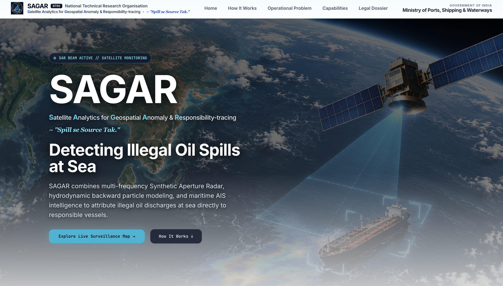

# 🌊 SAGAR — Satellite Analytics for Geospatial Anomaly & Responsibility-Tracing

> **“Spill Se Source Tak.”**
<p align="center">
  
</p>

SAGAR is a satellite-powered maritime surveillance and pollution attribution platform designed to detect suspicious oil discharges, trace their likely source vessel, analyze spill movement, and generate evidence-oriented enforcement reports.

---

## 🚨 The Problem

Illegal oil and bilge-water discharge can occur beyond routine patrol visibility, allowing spills to spread before they are detected and attributed.

SAGAR addresses this gap by combining:

- 🛰️ Satellite radar imagery
- 🌊 Ocean-current and drift modelling
- 🚢 AIS vessel tracking
- 🤖 Automated anomaly detection
- ⚖️ Evidence-oriented reporting

---

## 🎯 What SAGAR Does

### 1. Monitor

Continuously analyzes satellite data across monitored maritime zones to identify suspicious surface anomalies.

### 2. Detect

Uses SAR signatures and computer-vision techniques to identify and segment potential oil slicks.

### 3. Identify

Backtracks detected spills using ocean-current models and correlates the results with AIS vessel trajectories.

### 4. Report

Generates structured incident and enforcement reports containing detected locations, vessel correlations, drift analysis, and supporting evidence.

---

## 🧠 Core Capabilities

### 🛰️ Satellite Surveillance

- SAR-based maritime monitoring
- Automated surface anomaly detection
- Regional incident monitoring

### 🔎 Forensic Attribution

- Lagrangian reverse hindcasting
- AIS spatiotemporal correlation
- Vessel trajectory and speed analysis
- Counterfactual attribution analysis

### 🌊 Impact Analysis

- 48-hour spill-drift simulation
- Advection and dispersion modelling
- Coastal receptor risk assessment
- Containment planning support

### ⚖️ Enforcement Support

- Structured statutory reporting
- Evidence aggregation
- Cryptographic integrity mechanisms

---

## 🗺️ Operational Workflow

```text
Satellite Surveillance
        ↓
Oil Spill Detection
        ↓
Reverse Drift Analysis
        ↓
AIS Vessel Correlation
        ↓
Source Attribution
        ↓
Impact Assessment
        ↓
Enforcement Report

🛠️ Technology Stack
Layer	Technology
Frontend	React + TypeScript
Styling	Tailwind CSS
Build Tool	Vite
GIS	Leaflet / React-Leaflet
Mapping	Esri World Imagery
Modelling	Lagrangian Drift & Advection Models
Data	SAR, AIS & Oceanographic Data

```
## 📂 Project Structure
sagar/
├── public/
│   └── assets/
├── src/
│   ├── components/
│   │   ├── LandingPage.tsx
│   │   ├── MapViewer.tsx
│   │   ├── ForensicsView.tsx
│   │   └── ForwardImpactAnalysis.tsx
│   ├── data/
│   │   └── incidents.ts
│   ├── types/
│   │   └── index.ts
│   ├── App.tsx
│   ├── index.css
│   └── main.tsx
├── package.json
├── tailwind.config.js
├── tsconfig.json
└── vite.config.ts

## 🚀 Key Workflow
1. Select an active maritime incident.
2. Inspect the detected spill and satellite evidence.
3. Reverse the drift to estimate the discharge window.
4. Correlate AIS vessel trajectories.
5. Analyze forward spill movement and coastal impact.
6. Generate the corresponding incident or enforcement report.

## ⚖️ Regulatory Alignment
SAGAR's analytical workflow is designed around maritime pollution monitoring and enforcement processes, with consideration for applicable Indian and international maritime pollution frameworks, including:
- Merchant Shipping Act, 1958
- MARPOL 73/78
- Indian Coast Guard maritime-environment responsibilities

## 🔐 Security & Integrity
The platform is designed with evidence integrity in mind, including cryptographic hashing and traceable links between:
Satellite Data → AIS Data → Drift Analysis → Incident Report

## 📜 License
Proprietary / Defense Research
This project is intended for research, demonstration, and maritime-security applications.
Unauthorized reproduction or redistribution is subject to applicable laws and project ownership terms.